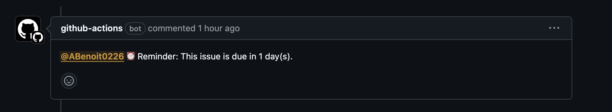

# Deadline Notification GitHub Bot

A basic notification bot that takes advantage of the GitHub repository workflows to track issues and notify assigned members.

By default, it notifies the assignee 1 week, 1 day, and day of the deadline by commenting on the issue and @'ing. 


The deadline is specified by adding a label to the issue in the format: 
```
deadline:YYYY-MM-DD
```

It also notifies a reviewer when the deadline has passed by adding a label in the format:
```
reviewer:GITHUB_USERNAME
```

## Table of Contents

1. [Getting Started](#getting-started)

    1.1. [For Individual Repository](#for-individual-repository)

    1.2. [For All Repos in an Organization](#for-all-repos-in-an-organization)

## Getting Started

Follow the steps below to run the Deadline Notification GitHub Bot:

### Copy the .github and package.json file to your repo

This can be a separate repository from the issue repository or in the same repo.

### For Individual Repository

#### Add your repository name and repository owner name to deadline-check.mjs

Modify the fields at the top of deadline-check.mjs in your repository
```
const owner = ""
const repo = ""
```

#### Ensure the bottom of deadline-notifier.yml is as follows:
```
        run: |
          node .github/scripts/deadline-check.mjs
```
It should be using the deadline-check.mjs script.

#### Create a Fine-Grained Personal Access Token [Here](https://github.com/settings/tokens)

In repository permissions, give this token read and write access to issues. It will also default to giving read access to metadata.

Note: The token creator must be an owner or have admin privileges on the repository with issues.

#### Add the token value to the repository with the .github code

Go to the repository settings > Secrets and variables > Actions > New repository secret.

Give the token the name PERSONAL_ACCESS_TOKEN so that it matches the .yml file and paste in the copied value from the token creation process.

### For all Repos in an Organization

#### Add organization name to deadline-checkorg.mjs

Modify the org field at the top of deadline-check.mjs in your repository
```
const org = ""
```

#### Ensure the bottom of deadline-notifier.yml is as follows:
```
        run: |
          node .github/scripts/deadline-check-org.mjs
```
It should be using the deadline-check-org.mjs script.


#### Create a classic Personal Access Token [Here](https://github.com/settings/tokens)

Give it ```repo``` and ```admin:org``` permissions.

Note: The token creator must be an owner or have admin privileges in the organization.

#### Add the token value to the repository with the .github code

Go to the repository settings > Secrets and variables > Actions > New repository secret.

Give the token the name PERSONAL_ACCESS_TOKEN so that it matches the .yml file and paste in the copied value from the token creation process.

### 3. Set Deadline

As a default, the workflow is set to check for deadlines daily at 8AM UTC. 

This can be modified at the top of deadline-notifier.yml
```
schedule:
    - cron: '0 8 * * *'
```

Use [this](https://cloud.google.com/scheduler/docs/configuring/cron-job-schedules) guide for scheduling format.

### 4. Test Bot

The bot is also set up to be run manually for testing purposes.

Make sure all above set steps have been pushed to GitHub

Start by creating an issue, adding an assignee, and a label with today's date as the deadline
```
deadline:YYYY-MM-DD
```

Go to the bot repository, select Actions, then the Deadline Notifier tab. Finally, select Run workflow and wait for the action to complete.

You should now find a comment on the test issue with an @ for the assignee.

